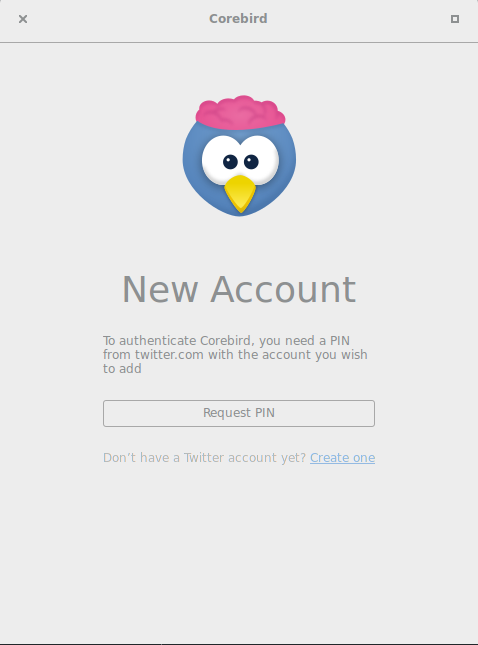
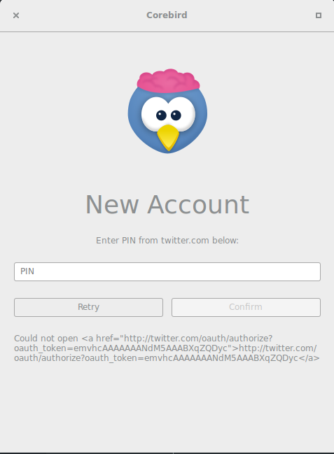

# Corebird Twitter client in a docker container

(Corebird)[https://corebird.baedert.org/] is among my favorite GUI twitter clients.

## Usage

To start using `gruen/corebird` use the following command:

```sh
docker run -d \
    -v /etc/localtime:/etc/localtime:ro \
    -v /tmp/.X11-unix:/tmp/.X11-unix \
    -v "${HOME}"/.config/corebird:/root/.config/corebird \
    -e DISPLAY=unix"${DISPLAY}" \
    --network host \
    --name corebird \
    gruen/corebird
```

On first run you'll be asked to request a pin:


Unfortunately, this won't work.

Luckily, you'll be presented with this page where you can copy the url and get a pin to enter:


Once you've entered the pin, your twitter feed should load.

Happy Tweeting!!

